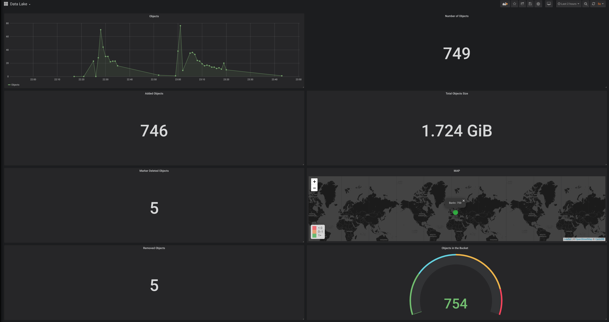
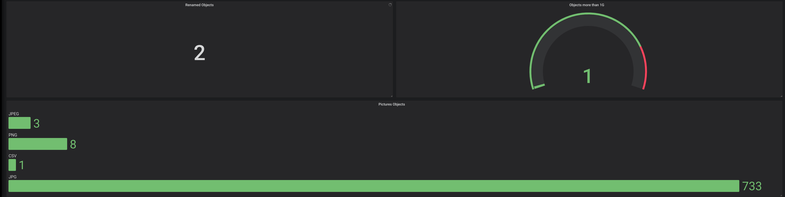

# AWS S3 Monitoring

By using aws Lambda, s3,flask and mysql

## Installations

Part 1:
* [AWS]
- Create Lambda function, lambda_function.py and change <domain/ip for api backend>
- Add requests.zip as a lambda layer.
- Enable Versioning On S3 bucket.
- On S3 Event, Check on "All object create events"
- On S3 Event, Check on "All object delete events"

Part 2:
* [API Backend]
- Use AWS EC2 or ECS.
- docker-compose up -d
